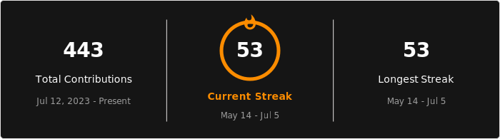
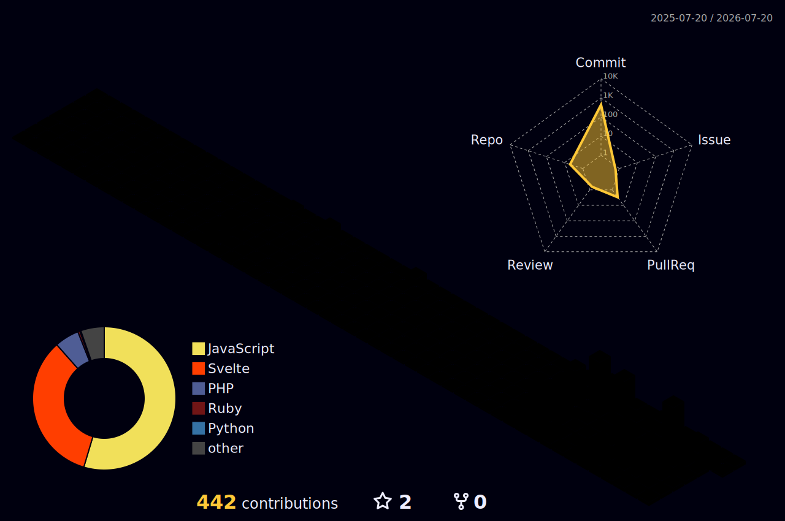

<h1 align="center">Hi, I'm Brener Fregulia</h1>

  Backend developer focused on relational databases, data migration, system integrations, and public-sector software.

  <a href="https://www.linkedin.com/in/brener-renan-duemes-fregulia-71325520a/">LinkedIn</a>
  ·
  <a href="https://github.com/brener-fregulia?tab=repositories">Repositories</a>

---

## Contribution streak

  

---

## 3D contribution graph

  

---

## Contribution graph

  

---

## Tools and technologies

  
  
  
  
  
  
  
  

  
  
  
  
  

---

## Currently learning

  
  
  
  

